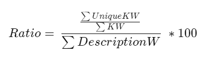
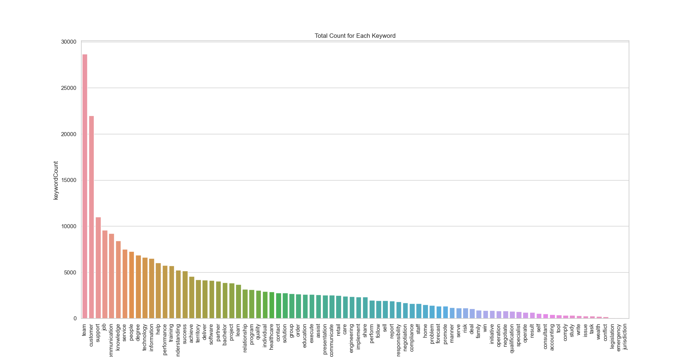
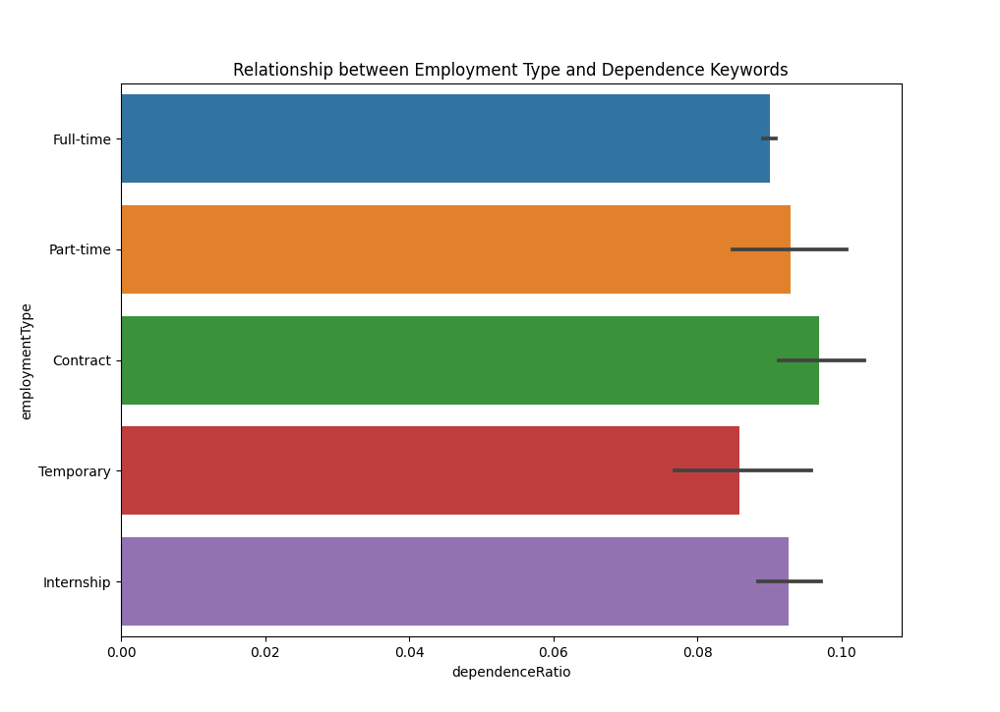
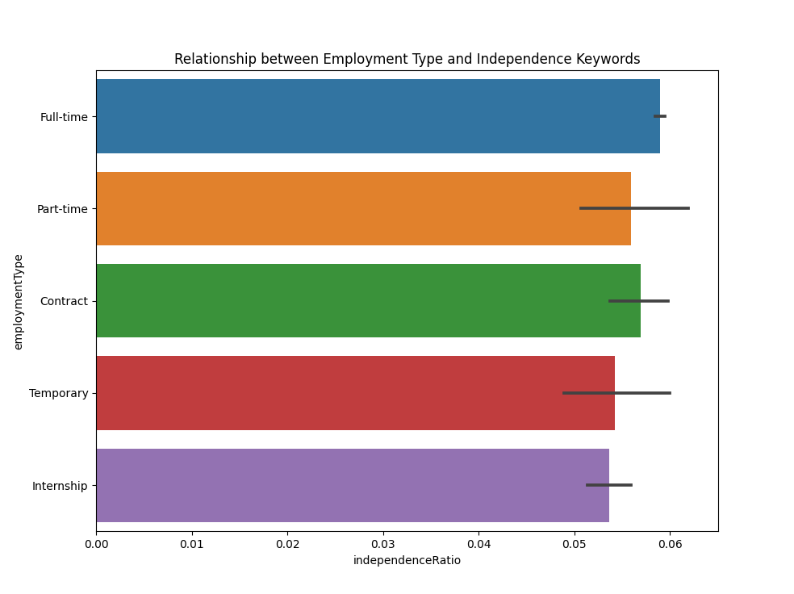
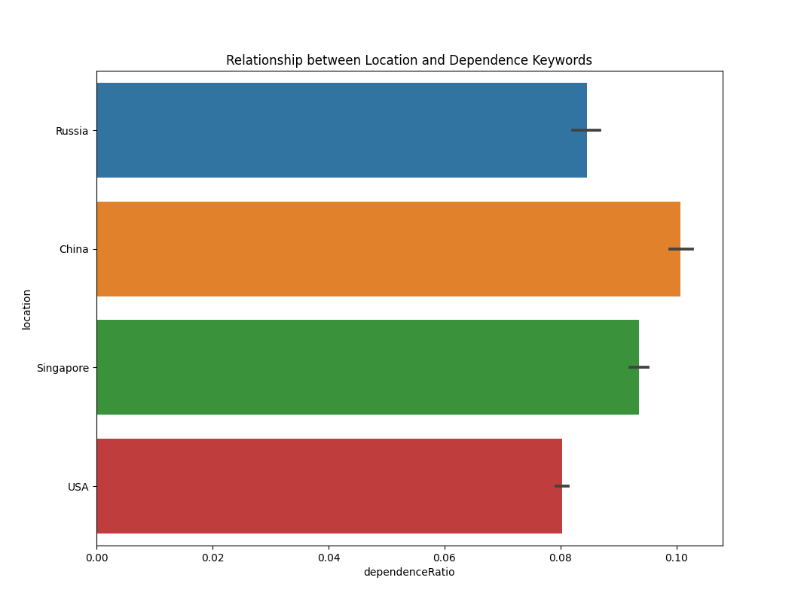
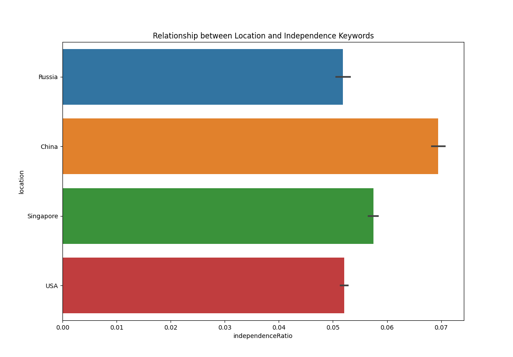
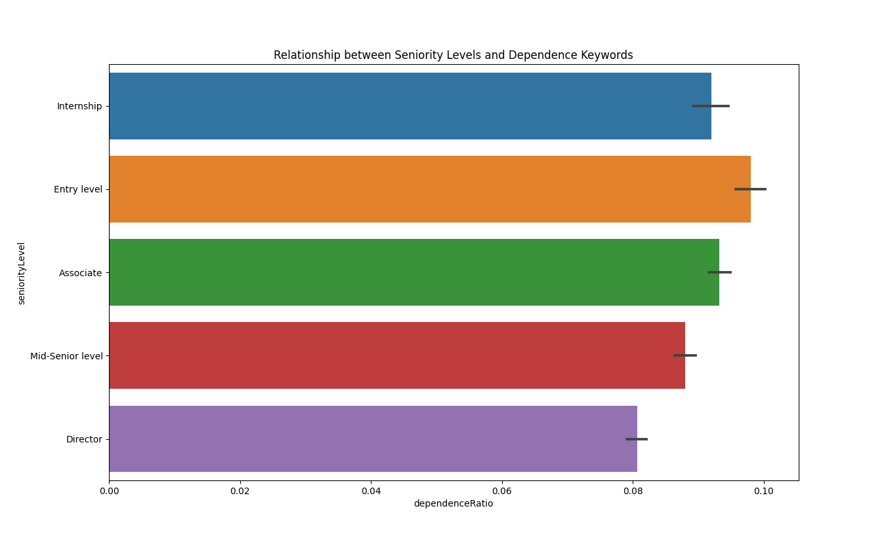
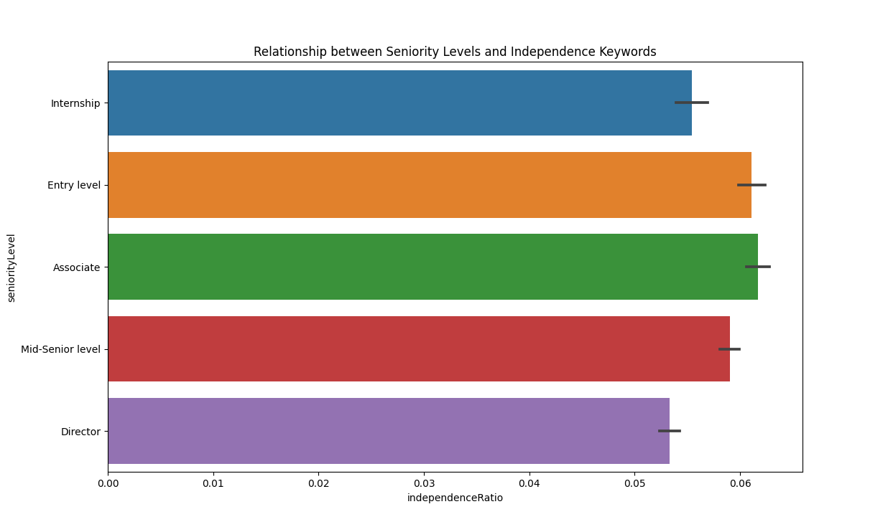

# Analysis

## Factors analysed

- Keywords
- Relationship between dependence and independence
- Employment Types
- Locations
- Seniority Levels

## Methods

Data analysis began after we scraped data from LinkedIn and started cleaning the data we collected.  

We used 12,234 cleaned data samples consisting of the following columns:

- jobTitle – What the title of the job/ tittle is i.e., Business Develop Manager or Area Sales Manager
- companyName – The name of the company
- Location – The countries the job was posted at
- datePosted – The date that the job was posted onto LinkedIn
- appStatus – The number of applicants
- description – Description of the role of the job
- seniorityLevel – Who fits this job best? Intern or a Director
- employmentType – The type of employment i.e., Full time, Part time or Contract
- jobFunction – What will you be doing at the job
- industries – Which industry is the company in
- dependenceRatio – Ratio of unique dependence keywords that appeared in description to total dependence keyword count scaled to description word count
- independenceRatio – Ratio of unique independence keywords that appeared in description to total independence keyword count scaled to description word count

To get a numerical representation of keywords in each data point, we created two ratios – dependence ratio and independence ratio. These numbers represent how many unique keywords appeared in each data point, scaled to the total words in the job description. The process was done using the Augmentor object. To get the ratio:

Seaborn - an open-source software, matplotlib-based Python data visualization library - was used for data analysis. It offers a high-level interface for creating visually appealing and informative statistical graphics. Along with Seaborn, we used Word Cloud, where words fill up a space of the commonly used words and in our case the keywords.

## Results

### Keywords

Word clouds are commonly used to make data more interactive and intuitive. From the word cloud, we can see that “team”, “customer”, “support”, “job”, and “communication” are the top 5 keywords. This is visually visible by the size of the words that immediately catch your attention.

The bar graph below further illustrates the count for each keyword. This also supports the word cloud data where we can see the word “team” is a commonly used word on LinkedIn. We used this graph to show the scale of each keyword and depict the overall landscape of popular keywords.

## Relationship between dependence and independence

To check the relationship between independence and dependence ratios, we plotted it using a linear regression plot, with the x and y labels being dependence and independence ratios respectively. From the analysis, we could see that overall, Chinese employers would require more independence and dependence traits from their applicants, and Russian and USA employers would require less. There was also a general upwards relationship between independence and dependence ratios.

## Employment Types

The team also examined the relationship between job employment types on their independence and dependence ratios respectively. The x plots were based on the ratios and y plots were based on the employment type. The calculations were based on the mean of all data points and there is an error bar plotted with 95% confidence interval.  

From the analysis, it can be concluded that full-time applicants required the most independence traits while contract workers required the most dependence traits. On the other hand, the lack of data is shown by the error bars. The team only had limited data on part-time, contract, temporary, and internship job postings, thereby reducing the accuracy of the respective results.

## Locations

The team also examined the relationship between locations on their independence and dependence ratios respectively. Like the previous plot, the data points were based on the mean and there is an error bar plotted with 95% confidence interval. 
Due to huge data sample size, it can be concluded that China required the most independence and dependence traits and USA required the least traits.

## Seniority Levels

Seniority levels were also analyzed based on their dependence and independence ratios. Similarly, to the previous plot, the data points were based on the mean and there is an error bar plotted with 95% confidence interval.  

From the analysis, it can be concluded that entry level jobs required the most dependence traits and high independence traits. This could be due to the highly competitive job market for fresh college graduates now. [10] Associate level jobs on the other hand required the most independence traits. Director level jobs require less independence and dependence traits.

