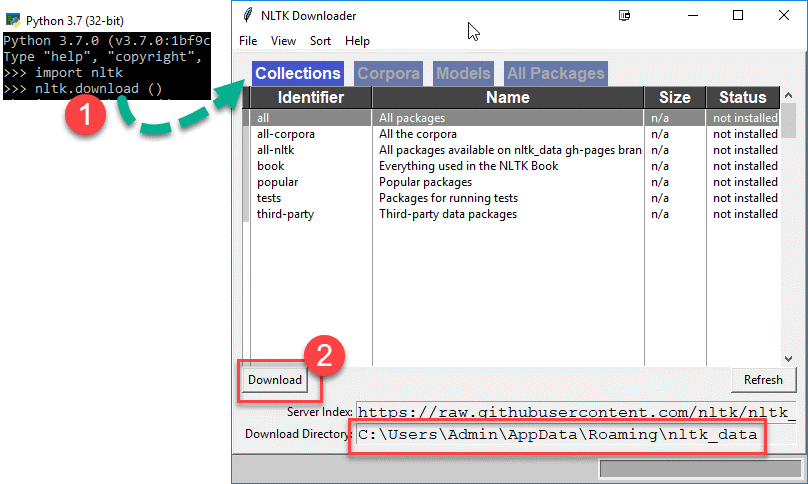

# Installation

- Firstly, download the Google Chrome web driver [here](https://chromedriver.chromium.org/downloads), make sure that you installed the correct version for your browser!
- Put ChromeDriver into Environment PATH Variable.
- After that, check whether pip is installed on your computer, type this into your terminal

```
    pip
```

- Install virtualenv module using pip.

```
    pip install virtualenv
```

- Then, [install Git](https://git-scm.com/download/win) on your computer and pull the repo into your local machine.
- Activate virtualenv, then install all required modules on your local machine. Use command prompt instead of Windows PowerShell!

```
    virtualenv venv
    cd ./venv/Scripts
    activate
    pip install -r requirements.txt
```

- Pull from this repository using `git`, then change working branch to production branch

```
  git clone https://github.com/rawsashimi1604/1002_LinkedIn.git
  git branch -f production origin/production
  git checkout production
```

- From there you should be good to go to start coding!

- To add to the codebase use Git! `git add .` adds all changes, `git status` checks status of Git, `git commit -m ...` adds a message to your commit for better referencing, `git push origin production` pushes your code to our production branch!

```
  git add .
  git status
  git commit -m "<enter your message here>"
  git push origin production
```

- To pull from existing codebase (get our latest updates), this will pull anything from master into your current production branch.

```
  git pull
  git merge origin/production
```

- To install complete NLTK Library required for data cleaning, open up a new python file and run the following code:

```python
import nltk
nltk.download()
```

This should open up a new window and select *“all”* and click on the button *Download* to download the dataset.

