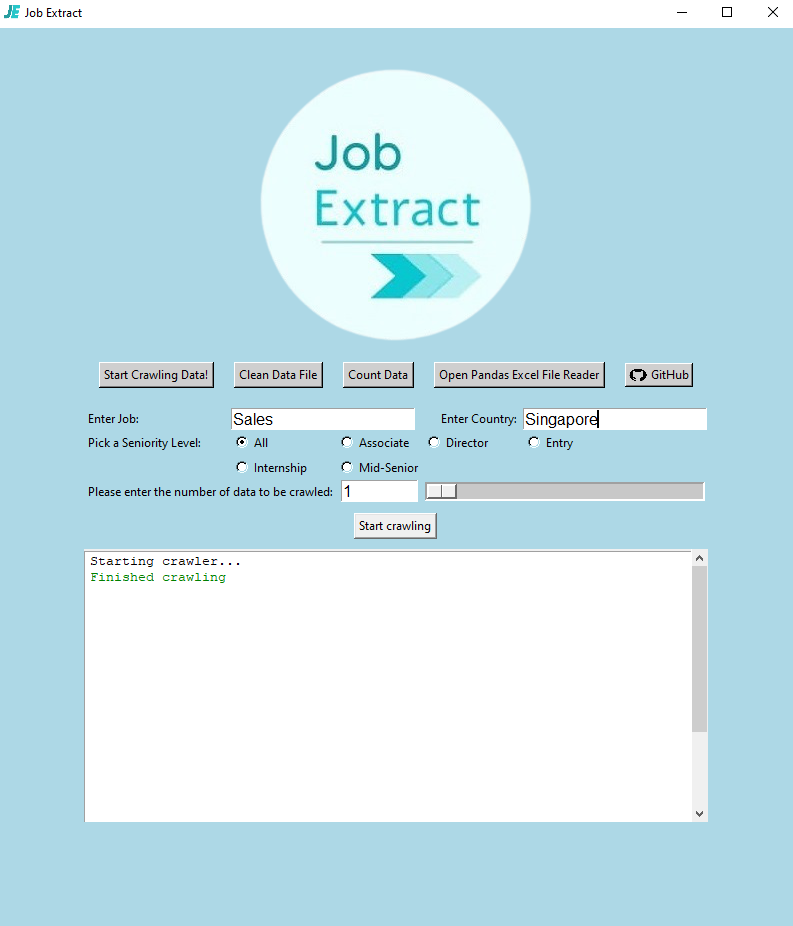
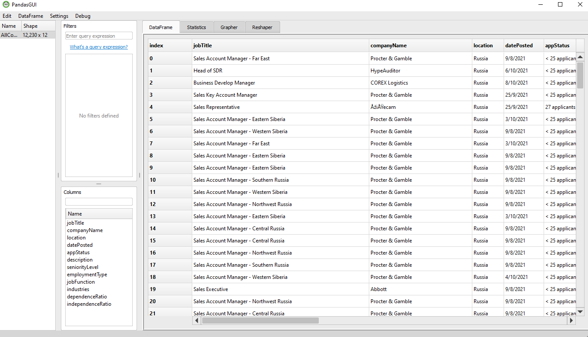

# JobExtract



## ICT 1002 Python Project

### Members: Xue Wang, Jon, Serene, Olivia, Gavin

We are students from Singapore Institute of Technology and this is our project for ICT 1002, where we were tasked to scrape data from LinkedIn and conduct job sentiment analysis.

## Overview

The objective of this project is to identify competencies that employers are looking out for. We scraped data from **LinkedIn** - one of the leading international recruiting platforms - and proceeded to process and analyze our data. The countries analyzed were _Singapore, USA, China and Russia._

### Libaries Used

| Library    | Function                                                      |
| ---------- | ------------------------------------------------------------- |
| Selenium   | Data crawling from LinkedIn, populate dataset                 |
| Pandas     | Data manipulation and analysis, manipulate numerical tables   |
| NLTK       | Natural language processing, working with human language data |
| Langdetect | Detecting language of data                                    |
| PandasGUI  | Viewing, plotting and analyzing Pandas DataFrames             |
| Tkinter    | Graphical user interface                                      |
| Seaborn    | High-level interface for drawing statistical graphs           |
| Matplotlib | Utility library to assist Seaborn in creating graphs          |
| Wordcloud  | Creating visual representations of keywords                   |
| Pillow     | Image processing                                              |

### User Guide

Users are able to crawl data, clean data, as well as open an interactive excel reader using the GUI.

- To crawl data, input the job, country, seniority level and number of data to be crawled. Do note that the maximum data to crawl is 1000.
- To view cleaned data, you can use the interactive excel reader, and import the excel data file.



### List of keywords

- Here are the list of keywords our team has been provided to analyze in job descriptions.

```
# Dependent Competencies
['customer', 'team', 'partner', 'people', 'relationship', 'communication', 'support', 'contact', 'understanding', 'responsibility', 'care', 'group', 'communicate', 'staff', 'manner', 'help', 'follow', 'share', 'partner', 'support', 'home', 'assist', 'family', 'serve', 'consultant']

# Independent Competencies
['job', 'solution', 'operate', 'knowledge', 'comply', 'degree', 'legislation', 'technology', 'write', 'deliver', 'sell', 'learn', 'software', 'performance', 'project', 'service', 'healthcare', 'perform', 'compliance', 'emergency', 'risk', 'bachelor', 'issue', 'retail', 'conflict', 'accounting', 'forecast', 'negotiation', 'achieve', 'jurisdiction', 'quality', 'information', 'territory', 'training', 'report', 'tool', 'presentation', 'problem', 'success', 'implement', 'individual', 'engineering', 'order', 'result', 'negotiate', 'specialist', 'deal', 'operation', 'promote', 'study', 'qualification', 'program', 'self', 'execute', 'initiative', 'task', 'win', 'wealth', 'education']
```

### Analysis

- Detailed analysis can be found [here](./Analysis.md)

## Installation

The installation guide can be found [here](./Installation.md).

## Timeline

- **Completed!!!!**
- Components:
  - ~~**Data Crawling** - 27 Sept~~
    - ~~Selenium~~
  - ~~**Data Cleaning** - 6 Oct~~
    - ~~Lang Detect~~
    - ~~NLTK~~
  - ~~**Data Analysis** - 14 Oct~~
    - ~~Seaborn~~
    - ~~Matplotlib~~
  - ~~**GUI** - 20 Oct~~

## Structure

Files are split into 3 folders, src. images and venv. **DO NOT ADD OR REMOVE FILES IN THE VENV FOLDER!** Venv is installed by the user.

```
    venv Folder (activate when coding)
      |_ ...
    images Folder (images)
      |_ ...
    src Folder
      |_ controller Folder (all logic related code)
          |_ __init__.py
          |_ augmentor.py
          |_ cleaner.py
          |_ counter.py
          |_ crawler.py
          |_ merger.py
          |_ processor.py
          |_ models Folder (data objects)
              |_ __init__.py
              |_ jobs.py
              |_ keywords.py
              |_ keywordsLook.py
      |_ data Folder
          |_ augmentedData Folder
              |_ (augmented data files...)
          |_ mergedData Folder
              |_ (merged data files...)
          |_ cleanedData Folder
              |_ (cleaned data files...)
          |_ rawData Folder
              |_ (raw data files...)
          |_ keywords Folder
              |_ (keywords data files...)
      |_ views Folder (analysis and GUI)
          |_ __init__.py
          |_ graphicUI.py
          |_ analysisPlots Folder
              |_ (plots....)
          |_ analysisWordCloud Folder
              |_ word_cloud.py
      |_ misc Folder (misc code, installer)
    README.md
    Installation.md
    Analysis.md
    requirements.txt (used to install modules in venv)
```
