# Job Extract User Guide


## Table of Contents
  * [Installation](#installation)
  * [User Guide for different Modules](#user-guide-for-different-modules)
    + [Crawler](#crawler)
    + [Processor](#processor)
    + [GUI](#gui)
      - [Crawling Data](#crawling-data)
      - [Cleaning Data](#cleaning-data)
      - [Counting Data](#counting-data)
      - [Opening PandasGUI](#opening-pandasgui)
      - [GitHub Page](#github-page)
## Installation

The installation guide can be found [here](./Installation.md).

## User Guide for different Modules
### Crawler
To use the crawler, navigate to `crawler.py` in the directory –
```
cd ./src/controller
```
 Then navigate down the bottom of the page. You will then see this block of
code:
```python
if __name__ == "__main__":
    myCrawler = Crawler()
    myCrawler.startCrawler("Sales", "Singapore", "Internship", 5)
```
Use the `startCrawler` function to run the crawler. Here is the documentation for the function.

```python
def startCrawler(self, job: str, location: str, seniorityLevel: str, count: int) -> None:
'''
    job : str => Selects job title to scrape
    location : str => Selects location to scrape
    seniorityLevel : str => Selects job seniority level to scrape
    Available Parameters:
    "All",
    "Internship",
    "Entry",
    "Associate",
    "Mid-Senior",
    "Director"
    count : int => Number of jobs to search (maximum 1000)
'''
```
For example, to crawl 5 samples of data for internship level sales jobs in Singapore, input the following code:
```python
if __name__ == "__main__":
    myCrawler = Crawler()
    myCrawler.startCrawler("Sales", "Singapore", "Internship", 5)
 ```
Run the code in your terminal using the following command  and make sure that you are in the directory `./src/controller`
```
py crawler.py
```
After running the code, wait for the browser to finish crawling the data file, and you should see this printed in your terminal: 

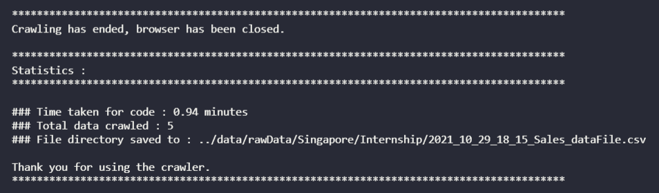

The scraped data file will now be in the directory
`./src/data/rawData/{location}/{seniorityLevel}/{timeStampedData.csv}`

### Processor
The processor is used to process raw data into processed data, making it easier to be used for data analysis.<br/>

The main 3 functions of it are:
- **Cleaner** -> `cleaner.py` - Clean `rawData` files into `cleanedData` files. Remove non English language data samples, set location of data samples, clean description to remove stop words, stem description and remove punctuation. Cleaned excel file is stored in `./src/data/cleanedData/{location}/{seniorityLevel}/{cleanedCSVfile.csv}`
- **Merger** -> `merger.py` – Merge all cleanedData files into a single file. Merged excel file is stored in `./src/data/mergedData/{mergedCSVFile.csv}`
- **Augmentor** -> `augmentor.py` – Adds in numerical data columns to help in data analysis. Augmented excel file is stored in `./src/data/augmentedData/{mergedCSVFile.csv}`

To use the processor, navigate to `processor.py` using the following command if you are in the root folder.
```
cd ./src/controller.
```

Then navigate down the bottom of the page. You will then see this block of code: 
```python
if __name__ == "__main__":
    myProcessor = Processor(format="all")
    myProcessor.process()
```

Use the `process` function to run the processor. Here is the documentation for the processor object:

```python
def __init__(self, format: str, manualFilePath: Optional[str]=None) -> Processor:
    '''
        format: str => Defines which files are to be processed.
        Available Parameters:
        •	"all" => Processes all files in all rawData directories,
        •	"latestAll" => Processes latest files in all rawData directories
        •	"single" => Processes single file, manualFilePath attribute needed
        manualFilePath: str (Optional) => Specifies path for "single" format processing.

    '''

def process(self) -> None:
    '''
        Main function, cleans files according to format class attribute, merges them together, then augments data points, saving it to a new file.
        Parameters: None
        Returns: None
    '''
```
The parameter `format` is used to decide which files are to be processed. For example, if you would like to clean all files, use the *all* parameter.

After running the code, this will be logged in the terminal:

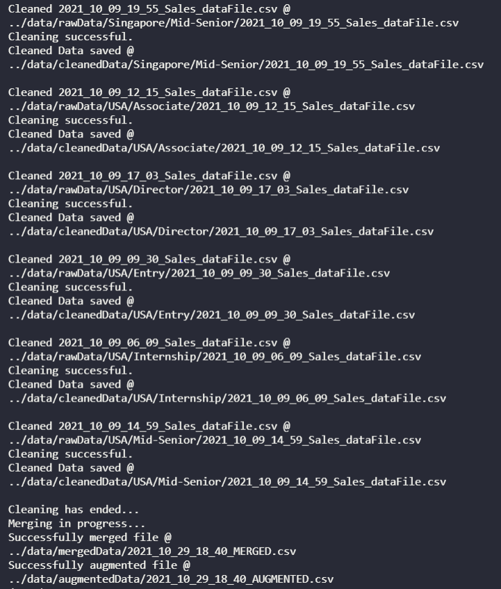

The file will then be saved to the directory: 
`./src/data/augmentedData/{ProcessedFile.csv}`

### GUI
To use the GUI, navigate to `graphicUI.py` in the directory using the following command.
```
cd ./src/views
```

Then, run the `graphicUI.py` code and make sure that you are in the directory `./src/views`

After running the code, wait for the GUI to be displayed. It should look like this:

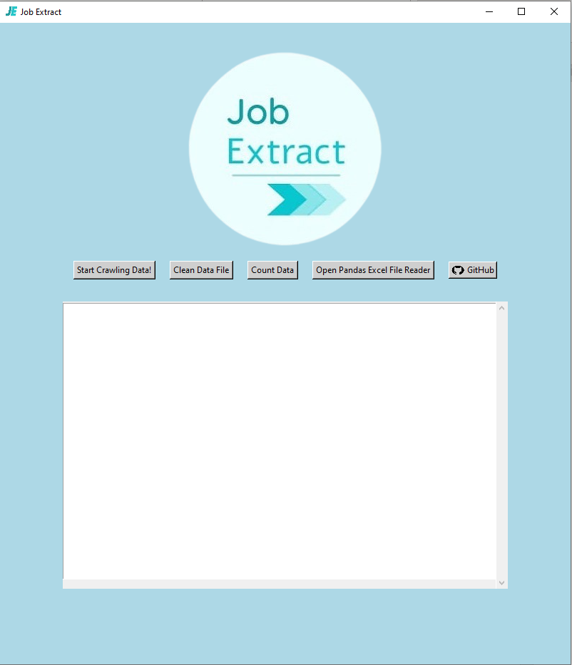

#### Crawling Data

To crawl data using the GUI, click on the *“start crawling data”* button. The following input fields should appear:

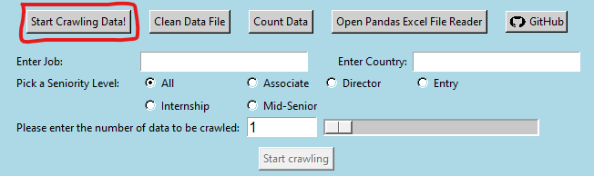

Next, input the crawler parameters in the input boxes, radio buttons and the slider:

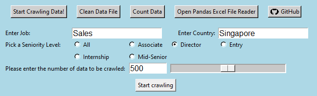

Finally, click on the *“Start crawling”* button. The GUI will then begin crawling process with the parameters that you have included and display the progress in the log below:

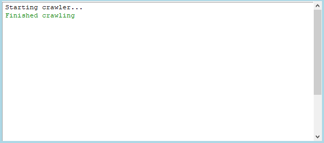

The scraped data file will now be in the directory 
`./src/data/rawData/{location}/{seniorityLevel}/{timeStampedData.csv}`

#### Cleaning Data
To clean the data using the GUI, click on the *“Clean Data File”* button. The GUI will then prompt you for the processing mode to be used:

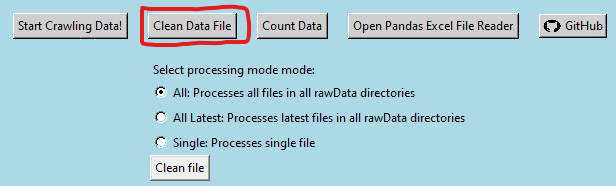

Finally, click on the *“Clean file”* button to begin the file cleaning process. The GUI will then begin the cleaning, merging and augmenting processes using the processing mode selected and display the progress in the log below: 

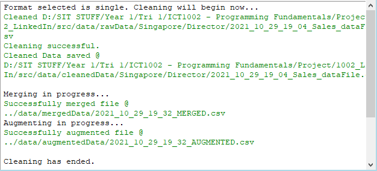

#### Counting Data
To count data using the GUI, click on the *“Count Data”* button. A file dialog will then appear to choose the file to be counted.

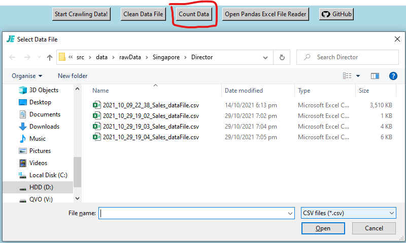

After selecting the file to be counted, the GUI will then begin the counting process using the file selected and display the progress in the log below:

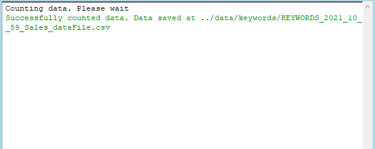

#### Opening PandasGUI
To open the `PandasGUI` to view data files, click on the *“Open Pandas Excel File Reader”* button. The log will then show that the Pandas Excel File Reader is being opened. A new window will then appear with the `PandasGUI` title:

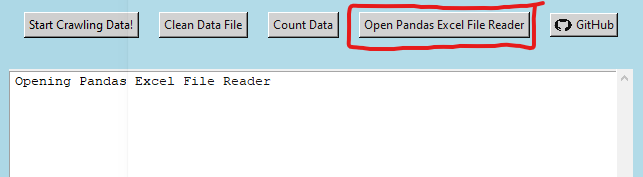

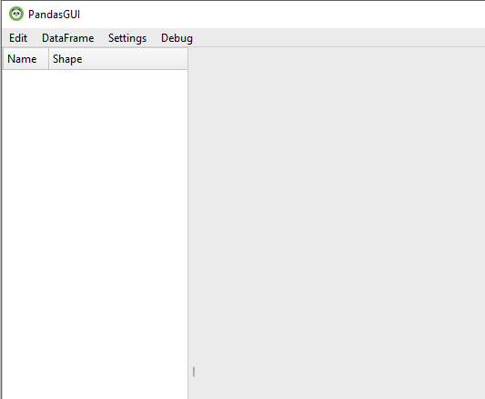

To view a excel file using the `PandasGUI`, click on *"Edit”*, and then click on *“Import”*. A file dialog will then appear to choose the data file to be viewed:

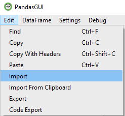

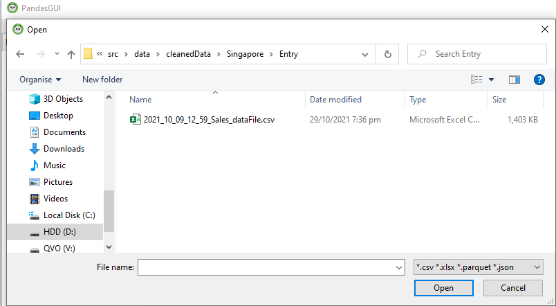

After selecting the file to be viewed, the DataFrame will then be displayed on the `PandasGUI` window:

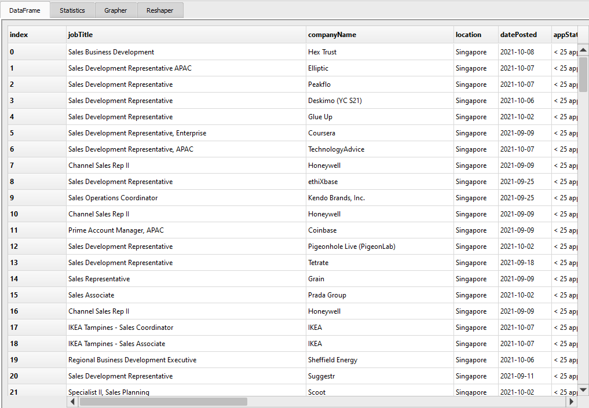

For more information on how to use PandasGUI, please refer to: https://pypi.org/project/pandasgui/

#### GitHub Page
To view the project’s **GitHub** page, for our detailed analysis on the data and to view installation guides, click on the *“GitHub”* button in the GUI:

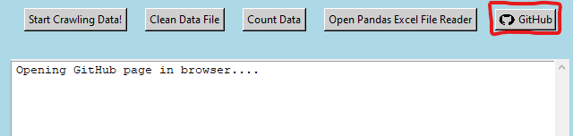

The GitHub page for our project will then be displayed in a web browser.